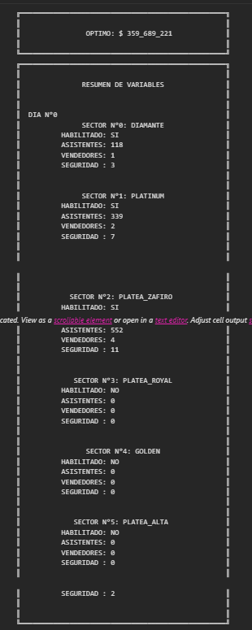

# Optimization Project - Second Semester 2021

This project was developed as part of the Optimization course during the second semester of 2021. It uses Gurobi to solve an optimization problem that models the assignment of people to sectors in an event, considering capacity constraints, availability of security and vendors, and maximizing benefits.



## Project Structure

- `main.py`: Contains the main function for the optimization model, where variables, constraints, and the objective function are defined. It also handles the model execution and displays the results.
- `parameters.py`: Defines the `Parameters` class, which stores all input data for the model, such as the list of people, sectors, capacities, costs, etc.
- `Print.py`: Provides auxiliary functions for printing the results in an organized manner, handling console output blocking and unblocking.
- `postoptimal.py`: Allows post-optimal analysis by varying different parameters like attendance, consecutive days, vendor opportunity costs, etc., to observe their impact on the optimal value.

## Requirements

- Python 3.x
- Gurobi Optimizer
- Additional packages: `pandas`, `numpy`

## Installation

1. Install Gurobi and obtain an academic license if necessary.
2. Clone the repository:

```bash
   git clone <REPOSITORY_URL>
```

## Execution

To run the optimization model, simply execute the `main.py` file:

```bash
   python main.py
```

To perform post-optimal analysis, run the `postoptimal.py` file:

```bash
   python postoptimal.py
```

There's also a Jupiter Notebook available named `Proyecto.ipynb` that contains the same code as the Python files but you can see the results without running the code.

## Post-Optimal Analysis

The `postoptimal.py` file allows performing analysis by varying different parameters of the model. To run an analysis, modify the indicator and the minimum and maximum values in the file and then run:

```bash
   python postoptimal.py
```

The results will be saved in CSV files inside the `postoptimal_analysis_data` folder.

## Key Features

Decision Variables:

- x: Indicates if a person is assigned to a sector on a given day.
- y: Indicates if a sector is enabled on a given day.
- w: Number of vendors in a sector on a given day.
- u: Number of security personnel in a sector on a given day.

## Key Constraints

- Maximum capacity per sector.
- Sectors must be enabled before assigning people.
- Limit on consecutive days of use for each sector.
- People can only attend one sector per day and must have a mobility pass.
- Minimum proportion of security and vendors per number of attendees.
- Objective Function: The objective function maximizes total profits, considering income from ticket sales and vendors, while subtracting costs associated with sector activation, security, ventilation, and sanitization.

## Results

The model provides a summary with:

- Optimal value of the objective function.
- Sectors enabled per day.
- Attendees, vendors, and security personnel assigned to each sector.
- Additionally, the post-optimal analysis allows evaluating the model's sensitivity to changes in key parameters, showing how they impact the optimal value and sector usage.
